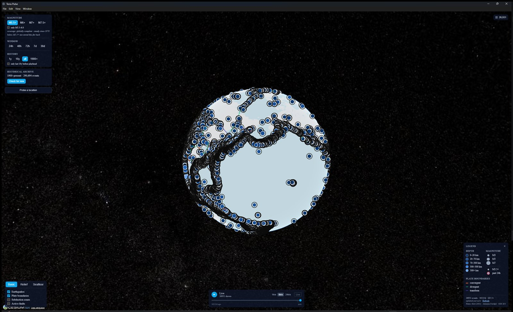
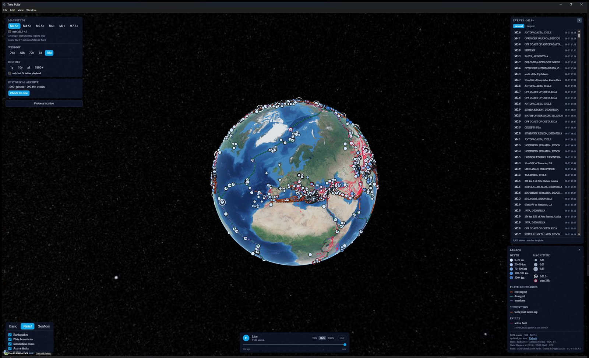
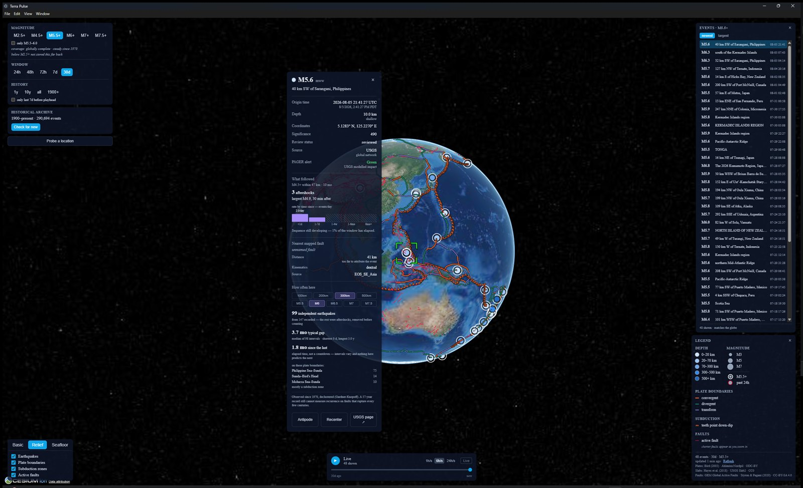
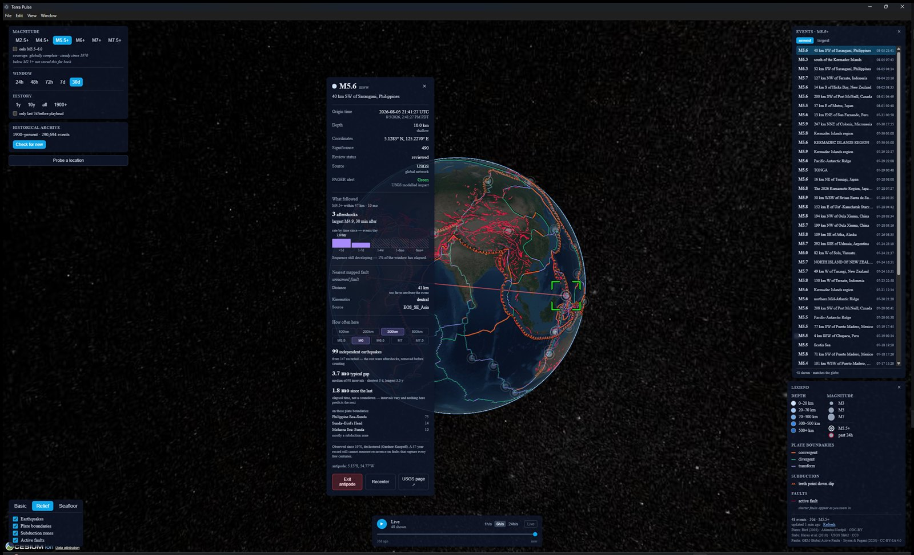

# Terra Pulse

A local-first Electron desktop app for exploring global seismicity — on an
interactive 3D globe, against 126 years of catalogue history, with the kind
of statistical guardrails that keep "interesting pattern" from turning into
"false claim."

It's a solo side project built to answer a genuine question (does seismicity
correlate with solar/geomagnetic/tidal activity?) without lying to myself
along the way. That constraint — *be honest about what 57–126 years of a
noisy, unevenly-instrumented catalogue can and can't tell you* — ended up
driving most of the interesting engineering.


*26,931 independently-verified M5.5+ earthquakes since 1970 (plus the M7.5+
deep archive back to 1900), rendered live against plate boundary and
subduction data — the Pacific Ring of Fire falls out of the data with no
manual tracing.*

---

## What it does

- **A 3D globe (CesiumJS)** showing live and historical earthquakes, plate
  boundaries, subduction zones, active faults, and multiple basemaps —
  scrubbable through time, filterable by magnitude and depth.
- **A ~300,000-row local SQLite catalogue**, backfilled from USGS: a rolling
  30-day cache for everyday use, plus a two-tier historical archive —
  M4.5+ back to 1970 and M7.5+ back to 1900 — currently 290,694 events.
- **Per-event analysis**, not just a dot on a map: observed aftershock
  sequences (Gardner-Knopoff declustered), nearest mapped fault with slip
  rate and kinematics, and a *recurrence interval* — how often independent
  earthquakes of a given size actually happen near this location, computed
  from the catalogue rather than asserted.
- **A hard line between looking and concluding.** Explore mode is free-form
  visual investigation and never states significance. Analyze mode (Phase 4,
  in progress) is where pre-registered hypotheses get tested with proper
  multiple-comparison correction. The app enforces which mode you're in.


*Every panel is sized to what it's showing — the layer panel, the
scrollable/windowed event list (26,746 rows in the widest view, ~26 ever
mounted as DOM nodes), and a legend that grows and shrinks with active
layers.*

### Click any earthquake and ask real questions of it


*This is the catalogue talking, not a model: 99 independent M6+ earthquakes
within 300 km since 1970, a 3.7-month typical gap between them, broken down
by which plate boundary each one sat on. "1.8 months since the last" is
labelled elapsed time — deliberately not a countdown.*

### See where the ground moved, straight through the planet


*A straight `ArcType.NONE` chord through the globe (not a geodesic arc over
the surface) from any event to its antipode, with the globe made translucent
and the far-side earthquakes dimmed so the line reads clearly.*

---

## Architecture

```
┌─────────────────────────────┐      IPC       ┌───────────────────────────────┐
│   Main process (Node)       │◄──────────────►│   Renderer (Chromium)         │
│                              │  normalised    │                               │
│  • USGS / EMSC ingest        │  schema only   │  • React + Zustand            │
│  • Poll + backfill scheduler │                │  • CesiumJS globe             │
│  • SQLite + R-Tree (better-  │                │  • Declarative GlobeLayer     │
│    sqlite3, WAL, migrations) │                │    registry (basemaps,       │
│  • Tile-identity header      │                │    quakes, boundaries,       │
│    injection (OSM policy)    │                │    faults, subduction)       │
└─────────────────────────────┘                └───────────────────────────────┘
              │
              ▼
     earthquake.usgs.gov (live feed + FDSN historical query)
     USGS Slab2 · Bird PB2002 · GEM Global Active Faults (vendored, static)
```

The renderer never touches the network — ingest lives in the main process
and hands the renderer normalised data over IPC, so every adapter (USGS,
EMSC, and whatever Phase 3 adds for solar/geomagnetic data) emits one shared
schema instead of leaking raw provider payloads into the UI.

| Layer | Choice | Why |
|---|---|---|
| Shell | Electron | Desktop-native, local SQLite, no server to run |
| UI | React 19 + Vite + TypeScript (strict) + CSS Modules | Colocated styles, no CSS framework to fight |
| State | Zustand | Small surface area, no boilerplate for what's mostly UI-selection state |
| Globe | CesiumJS | The only mainstream WebGL globe with real geodesic/ellipsoid math built in |
| Storage | SQLite + R-Tree, `better-sqlite3` | Synchronous, embeddable, fast enough at 300k+ rows with the right indexes |
| Analysis (Phase 4) | Python + FastAPI + numpy/scipy/statsmodels | Declustering, FDR correction, and the Monte Carlo work belong in a real stats stack, not hand-rolled JS |
| Ephemeris (Phase 4) | Skyfield + JPL DE440 | Sub-arcsecond planetary/lunar positions for the tidal/astronomical hypotheses |

**Monorepo** (pnpm workspaces): `apps/desktop` is the Electron app;
`packages/schema`, `packages/db`, and `packages/ingest` are independent,
independently-tested modules — schema is the single source of truth that
both TypeScript and (eventually) the Python engine generate against.

~19,400 lines of TypeScript, 45 test files, 37 commits — built solo,
July 24 to August 7, 2026.

---

## Engineering notes worth mentioning

A few things that came up building this, because "it works" undersells what
it took to get there:

- **Measured, not assumed, at every turn.** The M4.5–5.5 archive view is
  capped at one year because the all-years version at that floor is a
  documented **V8 out-of-memory crash**, not just slow — found by loading
  the real 306k-row database, not a fixture. Colour choices for the
  unknown-depth marker were validated with OKLab ΔE against both basemaps
  after a WCAG-passing grey turned out to still be indistinguishable at a
  glance.
- **The archive changed the cost of code that was never touched.** Adding
  ~295k rows to one table made several 30-day-sized assumptions silently
  wrong at once. One query planned as an unbounded index scan and cost
  **1.25s per call** — 63 minutes across a real backfill pass — until the
  missing time bound was added, dropping it to 0.2ms (6,431×).
- **Declustering is not optional, and the numbers show why.** Raw M6+ gaps
  near Tokyo have a 0.06-year median; after Gardner-Knopoff declustering,
  0.32 years. Reporting the raw number would be reporting network noise, not
  seismicity — so recurrence intervals refuse to print below 8 independent
  events rather than state something misleadingly precise.
- **Every migration is transactional**, including for R-Tree virtual tables
  and their shadow tables, verified with a test rather than assumed from
  SQLite's docs. A pre-migration `VACUUM INTO` snapshot means a failed
  migration aborts cleanly instead of leaving a half-changed schema.
- **Startup never blocks on the network.** An earlier version awaited a live
  USGS backfill before showing a window; if USGS was slow or unreachable,
  an app with a fully populated local database showed nothing. The window
  now renders immediately from local data and backfill notifies the
  renderer when new data lands.

---

## Data sources

All free, no paid keys required for the shipped features:

| Purpose | Source |
|---|---|
| Live earthquakes | USGS real-time feed |
| Historical earthquakes | USGS FDSN event query (ISC-GEM for 1900–1970 M7.5+) |
| Plate boundaries | Bird (2003) PB2002 |
| Subduction zones | USGS Slab2 |
| Active faults | GEM Global Active Faults Database |
| Basemaps | OpenStreetMap · NASA GIBS (relief) · GEBCO (seafloor) |

---

## Status

**Phases 1–2 complete**: layers, time scrubbing, the full historical archive
(both tiers), aftershock sequences, fault association, recurrence intervals,
plate-boundary context, alerts, and the "while you were away" digest are all
shipped and exercised against the real 306k-row catalogue, not just fixtures.

**Next**: Phase 3 (solar/geomagnetic ingest) and Phase 4 (the Python
analysis engine — pre-registered hypothesis testing with Benjamini-Hochberg
correction across the full test matrix, per `HYPOTHESES.md`).

## Running it locally

```bash
pnpm install
pnpm dev       # launches the Electron app in dev mode
pnpm test      # runs the test suite across all packages
pnpm build     # production build
```

Packaging a Windows installer: `pnpm --filter @terra-pulse/desktop package`
→ `apps/desktop/release/`.

---

Built by Todd Black.
